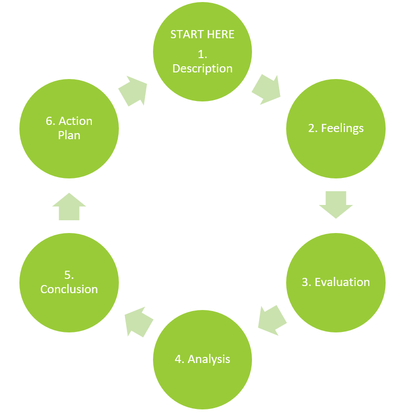

## Gibb’s Reflective Cycle (1988)

Reflective practice generally includes elements of self-evaluation, assessment of experience, reflective questioning, and conclusions or further inquiry. It is often conducted individually, but can also include elements of peer observation and feedback. As Larrivee (2000) argues, critical reflection also involves questioning of the status quo, including “examining the assumptions that underlie classroom practices” (p. 297). This is particularly important, since most of us have been students ourselves: we can too easily fall into the habit of replicating the way we have been taught, without evaluating the effectiveness of those practices.

Larrivee (2000) describes a process of critical reflection that involves three stages, arguing that the process is “more cyclical than linear, more incremental than sequential” (p. 304). The process she lays out includes the three key elements/stages of “examination,” “struggle,” and “perceptual shift” (p. 305).

As you prepare for your coaching/facilitation experiences in your practicum, you are challenged to consider the value of reflective practice, and how you can develop your own practice of self-reflection and critical inquiry. We will explore Gibbs’ Reflective Cycle, which you will use throughout this practicum.

Gibb’s Reflective Cycle (1988) includes six steps: *description, feelings, evaluation, analysis, conclusion, and action plan.* As you engage in your professional practice through this practicum, you will be asked to complete these steps for each element of the practicum (i.e. classroom observation, lesson plan design, and facilitation).

!!!! **Description**: You will begin by describing the teaching/facilitation experience (or the process of designing a lesson plan).

!!!! **Feelings**: You will consider the feelings (and the feelings of students) during the teaching/learning process.

!!!! **Evaluation**: In this step, you will evaluate the experience.

!!!! **Analysis**: You will then analyze the experience. At this stage, you will find it helpful to look at the experience through the lens of the literature you have read in previous courses.

!!!! **Conclusion**: At this stage, you will draw conclusions about your teaching/learning experience.

!!!! **Action Plan**: Based on the previous steps, you will develop steps to take to continually improve your teaching/facilitation practice.

In the Learning Activities, you will review resources that provide a deeper look at Gibbs' Reflective Cycle. As you review those resources, begin thinking about how you will apply these within your practicum setting. You will write about this in your Reflective Practice Discussion 2.

[plugin:content-inject](../_1-2)
