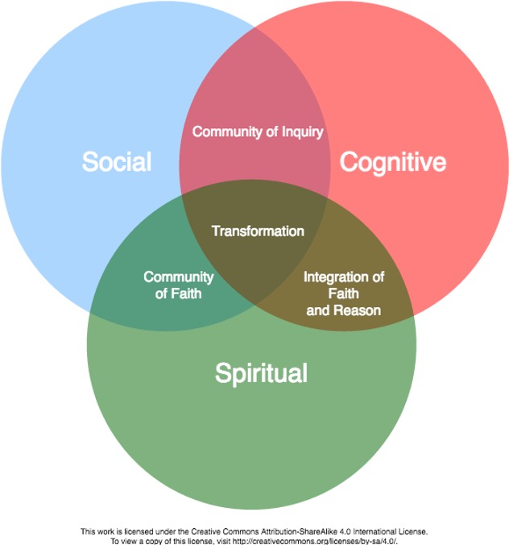

## Authentic and Inclusive Learning Experiences (Lesson Plan 1)

Now that we have reviewed lesson plan design, including creative effective learning outcomes and integrating principles of adult learning theory, how can we make our lessons transformational for students? In this unit, you will design a lesson plan that integrates strategies to create an authentic, inclusive, liberating learning experience.
As humans, we long for authenticity in our relationships. We want to feel "at home" in the organizations that are part of our lives -- our families, schools, communities, places of worship. We seek connection. We search for a place where we are known.
This sense of being "at home" is essential to our experience as learners. Deep, authentic learning happens in spaces where we feel connected with others -- places and spaces where we are known. Palmer (1998) refers to this as the "spiritual quest for connectedness" (p. 5).
In his book, *The Courage to Teach: Exploring the Inner Landscape of a Teacher's Life*, Parker Palmer (2017) argues that the "inner landscape of teaching" is an essential foundation out of which authentic learning experiences emerge.

"Teachers possess the power to create conditions that can help students learn a great deal -- or keep them from learning much at all. Teaching is the intentional act of creating those conditions, and good teaching requires that we understand the inner sources of both the intent and the act" (Palmer, 2017, p. 7).

Learning communities are authentic, emotionally-safe and inclusive spaces (whether physical or virtual) where learners and teachers come together to engage in deep learning. By definition, a learning community includes both LEARNING and COMMUNITY.

Below are three key learning community models you studied in LDRS 664. As you review these models, consider how you will integrate principles from one of these models in your lesson planning.

**Learning Community Pyramid (Bower & Dettinger, 1998)**

The Learning Community Pyramid, developed by Bower & Dettinger (1998) includes academic, social, and physical components. They describe academic components as those that focus on the curriculum and learning that takes place. The social components are the elements of trust and inclusivity that create space for community. The physical component is the “place or facility where the community meets or resides” (Bower & Dettinger, 1998, p. 17). In the case of this course, that “place” is the course hub.

**The Community of Truth (Palmer, 2017)**

Palmer’s (2017) learning community model incorporates both learning and community” with a “subject” as the center, surrounded by “knowers” who are in relationship to both each other and the subject. Palmer (2017) assets that “the community of truth, far from being linear and static and hierarchical, is circular, interactive, and dynamic” (p. 106). The learning that takes place in this model is captured in this statement: “I understand truth as the passionate and disciplined process of inquiry and dialogue itself, as the dynamic conversation of a community that keeps testing old conclusions and coming into new ones” (p. 106). Instead of solely focusing on what we must teach (and what students must learn), Palmer challenges us to consider how we all might learn something more together – more than is already known – through the teaching/learning experience. In this way, we must consider that we are not just engaged in transferring information or knowledge, but that (in addition to that), together we might create new knowledge.

**The Trinity Community of Inquiry (Madland, 2017)**

In our online courses, Trinity Western University seeks to create learning communities that engage student learning on a cognitive, social, and spiritual level. The Trinity Community of Inquiry model is a visual representation of these three aspects of learning (Social, Cognitive, and Spiritual), and how they interact with each other. At the intersections of these elements, you find:

1. Community of Inquiry
2. Community of Faith
3. Integration of Faith and Reason

Combined, these three elements can lead to transformational learning – an aspiration we hold in this course and program – and a fundamental goal of higher education in a broader sense.

[plugin:content-inject](../_3-2)
