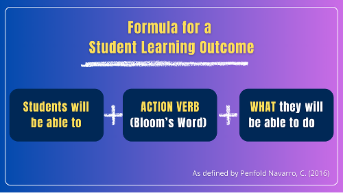

# Pre-work - Practicum Proposal

## Overview {.unnumbered}

Welcome to LDRS 667: Practicum - Personal and Professional Practice and Reflection. In this unit, **which needs to be completed prior to the start of the course,** you will prepare for your practicum in coaching and facilitation in a professional learning setting.

As you prepare to engage in your practicum, you will complete pre-work that includes preparing and submitting a Practicum Proposal for review by your instructor, and reviewing materials from previous courses.

This course provides students with a practical setting in which to apply what they have learned in the Certificate in Coaching and Facilitation. Using reflective practice, learners apply learning theory, assessment theory, facilitation practices, and cross-cultural competency, in a professional learning facilitation setting. The practicum must be with a supervised business, non-profit agency, social service agency, school, university, or institution related to the student’s personal interests and future plans.

### Topics {.unnumbered}

This unit is divided into the following topics:

1. Selecting a Practicum Site
2. Writing your Practicum Proposal
3. Preparing to Teach/Facilitate

### Learning Outcomes {.unnumbered}

When you have completed this unit, you will be able to:

- Select a practicum site
- Formulate personal learning outcomes for the practicum experience
- Develop a plan to complete the required 10 hours of observation and 10 hours of lesson plan design and facilitation (including facilitation of an online or onsite discussion).

### Learning Activities {.unnumbered}

Here is a list of learning activities that will support you in completing this unit. You may find it useful for planning your work.

::: {.learning-activity}

- Select and create a description of your practicum site and mentor.
- In preparation for your practicum, review prior course materials as suggested.
- Create personal learning outcomes that describe what you hope to learn during this practicum.
- Develop detailed plans for your practicum and complete your practicum proposal for submission.

:::

### Assessment {.unnumbered}

See the Assessment section in Moodle for assignment details.

### Required Texts and Materials {.unnumbered}

Here are the resources you will need to complete this unit.

- Palmer, P.J. [-@palmerCourageTeachExploring2017]. *The courage to teach: Exploring the inner landscape of a teacher’s life*. Jossey-Bass.

Other online resources will be provided in the unit. Refer to the References section at the end of the unit for the full list.

## Practicum Proposal

In this practicum, you will engage in rich, experiential learning, deepening your skills in teaching/facilitation and applying scholarly learning from previous courses within a practical setting. To prepare for this experience, you will create a Practicum Proposal as guided in this unit and submit it in Moodle for your instructor’s review.

**Before completing your Practicum Proposal – and before this course begins – you will need to identify a Practicum Site.** You may already have a practicum site in mind. If not, be sure to select a site that will give you a meaningful opportunity to practice your coaching and facilitation skills.

You will also need to secure a mentor at your site. Your practicum mentor will serve as your practicum contact, provide feedback on your teaching or facilitation, and confirm that you have completed your required observation and teaching/facilitation hours.

#### *How to Select Your Practicum Site* {.unnumbered}

You can complete your practicum **on-site or online**. The practicum site you choose should allow you to:

- **Observe at least 10 hours** of teaching or facilitation
- **Design and facilitate at least three lessons** (totaling at least 10 hours)
- **Facilitate at least one hour** of online or face-to-face discussion (with each facilitation lasting at least 20 minutes)

This adds up to the **20 hours of experiential learning** required for the practicum.

#### *Where You Can Complete Your Practicum* {.unnumbered}

Your practicum can take place in a variety of settings, including:

- Companies or organizations (training, organizational development, HR)
- Colleges, universities, or K–12 schools
- Community organizations or non-profits
- Places of worship
- Online learning communities or virtual instructional spaces
- Any setting where teaching, coaching, or facilitation occurs

#### *Working With a Trinity Faculty Mentor* {.unnumbered}

You may also ask a Trinity faculty member to serve as your mentor and use their class as your practicum site. This is a great option if you don’t have an immediate placement or want additional support and feedback throughout the process.

#### *If You Don’t Have a Workplace* {.unnumbered}

You do not need to be employed to complete your practicum. Many students secure placements by:

- Reaching out to local organizations, schools, or community groups
- Partnering with a trainer, facilitator, or professor to observe and co-facilitate
- Exploring networks in professional, academic, community, or faith-based setting

If you’re not sure whether a site will meet the requirements, reach out to your instructor for guidance. The goal is to choose a placement that supports your learning, allows you to practice facilitation skills, and provides opportunities for feedback from a mentor.

::: {.note}

*Note:* Remember that your practicum site and mentor must be confirmed **before the course starts** so that you are ready to begin your experiential learning from day one. Because securing a practicum site and mentor can take some time, we recommend starting this process at least **a month in advance**.

:::

### Activity: Describe your Practicum Site and Mentor

This learning activity will guide you in developing your practicum proposal, which you will submit for instructor review before the course begins.

::: {.learning-activity}

Create a description of your practicum site. This should include details such as whether you will be observing a specific professor, teacher, or trainer, and the context for your observation and facilitation. For example, will you be observing a professor and then facilitating live discussions in her onsite class?

Complete and include the signed [Mentor Agreement](assets/u1/LDRS_667_Mentor_Agreement.pdf){target="_blank"} in your practicum proposal.

:::

::: {.note}

*Note:* Although you need to identify your site for this assignment, you should consider whether you want to keep the site anonymous for your discussions in the Practicum Course. If so, be sure to indicate in your proposal how you will avoid identifying details in course discussions.

:::

## Preparing to Teach/Facilitate

As you prepare for your practicum experience, now is a great time to review materials you have previously studied in your graduate studies. As you consider these materials, begin to think about the nature of the learning environment you want to create, and the learning experiences you imagine for your students. Consider what you hope to learn in this Practicum by observing your Practicum Mentor. Reflect on what skills you hope to develop. This is a great time to dive into some of the books, articles, and videos you studied in previous courses and have wanted to read/view again.

### Activity: Preparation for Practicum

::: {.learning-activity time="60"}

To prepare for the practicum, review the relevant textbooks and resources. Begin by re-reading the following chapters from *The Courage to Teach: Exploring the Inner Landscape of a Teacher’s Life* [@palmerCourageTeachExploring2017]:

- "Introduction"
- Chapter 1, "The Heart of a Teacher"
- Chapter 3, "The Hidden Wholeness: Paradox in Teaching and Learning"

If you need a refresher on how to write Learning Outcomes for your practicum, review the prior course materials along with the following resources:

- ["Learning Outcomes"](https://teaching.uwo.ca/curriculum/coursedesign/learning-outcomes.html){target="_blank"} [@centreforteachingandlearningLearningOutcomes]

::: {#fig-image}

{#fig-u1_1 .lightbox fig-alt="Formula for a Student Learning Outcome "student will be able to" + action verb + "what they will be able to do"}

*Formula for a Student Learning Outcome*

:::

::: text-source
Created by C. P. Navarro, R. Kang, and TWU. Licensed under [CC BY-SA 4.0](https://creativecommons.org/licenses/by-sa/4.0/){target="_blank"}

:::

You may also wish to review your Reflective Journal from previous courses. As you review these materials, consider what you hope to learn in your Practicum experience.

:::

## Reflecting on Your Learning Goals

This practicum is an opportunity not to teach or facilitate, but to reflect deeply on your growth as a coach and facilitator. As part of your practicum proposal, you will develop **personal learning outcomes**—statements that capture what you hope to learn through your observation, lesson planning, and facilitation experiences.

Think of this as a chance to connect your practicum work to the concepts and skills you have explored in previous courses: creating authentic learning communities, designing culturally inclusive teaching and learning experiences, coaching for transformational learning, and applying adult learning theory in practical settings.

### Activity: Create Personal Learning Outcomes

This learning activity will guide you in developing your practicum proposal, which you will submit for instructor review before the course begins.

::: {.learning-activity}

Referring to the tips below, create three personal learning outcomes that describe what you want to learn in this practicum. These learning outcomes will shape your experiential learning in this practicum.

*Tips for Writing Your Learning Outcomes*

1. **Be specific and realistic.** Focus on a skill or knowledge you can reasonably develop in 20 hours of experiential learning (observation, lesson plan design, and facilitation).
2. **Reflect on what you have learned already.** How can your practicum experience build on what you’ve already learned?
3. **Think about how you want to grow.** Learning outcomes should describe what you want to *learn*, not just what you plan to do.
4. **Use one clear verb per outcome.** For example: identify, design, facilitate, apply, analyze, integrate. (Refer to Bloom’s Taxonomy if you’re looking for learning verbs).
5. **Focus on the outcome, not the process**. In your learning outcomes, focus on what you hope to learn – such as being able to design a lesson plan or facilitate an online discussion board.

:::

#### *Suggested Approach* {.unnumbered}

For your Practicum Proposal, you will develop three learning outcomes for yourself – three things you want to learn. Since your practicum includes three core areas (observation, lesson planning, and facilitation), you might consider one learning outcome for each core component of the practicum:

#### *Observation (Minimum 10 hours)* {.unnumbered}

Think about what you hope to notice and understand by watching someone else teach or facilitate. For example, during your observation hours, you might want to specifically observe how the instructor creates an inclusive, authentic learning community, or the strategies they use for engaging adult learners in meaningful dialogue. You might also want to notice how the instructor adapts their content, based on the diverse needs of the learner.

Once you determine what you want to learn, you can then write a learning outcome for yourself, such as: At the completion of this practicum, I will be able to: Identify strategies facilitators use to create culturally inclusive learning spaces.

#### *Lesson Plan Design and Facilitation (Minimum 10 hours, Minimum 3 Lessons)* {.unnumbered}

Reflect on what you hope to learn by designing a lesson plan – and facilitating that lesson plan. For example, you will design lesson plans that incorporate culturally responsive teaching strategies and adult learning theory, and focus on creating an authentic learning community.

Once you determine what you want to learn, you can then write a learning outcome for yourself, such as: At the completion of this practicum, I will be able to: Design a lesson plan that builds on the learners’ current knowledge.

#### *Facilitation or Teaching (Minimum 1 hour total; 20 minutes minimum per session)* {.unnumbered}

Reflect on what you hope to learn as you practice facilitating an online or onsite discussion. You may want to learn how to facilitate a discussion in a way that promotes deep learning and critical thinking. Perhaps you want to focus on learning how to keep a conversation going among students, centering their learning by asking students to talk more than you do. Or, perhaps you might want to learn how to adjust your facilitation style based on learners needs.

Once you’ve taken some time to reflect on what you want to learn through your facilitation, you can write a learning outcomes such as: At the completion of this practicum, I want to be able to: Facilitate a discussion that promotes deep learning.

### Activity: Create Detailed Plans for Your Practicum

This learning activity will guide you in developing your practicum proposal, which you will submit for instructor review before the course begins.

::: {.learning-activity}

Create the following sections for your practicum proposal:

- **Planned Schedule for 20 Hours of Experiential Learning**, to include:
    - Observation of Teaching (Minimum of 10 hours): Include details about when and where you will observe teaching. Be sure to coordinate this now with those you hope to observe.
    - Designing and Facilitating Lessons/Classes (Minimum of 10 hours, Minimum of 3 Lessons). Include details about the three lessons you plan to design and the lesson plans you hope to facilitate. (Ideally, you will facilitate the lesson plans you design, however, you may need to facilitate different lessons, based on the needs of your practicum site).
    - Facilitating Online or Face-to-Face Discussions: Include details about where and when you plan to facilitate these discussions.
- **Learning:** An analysis of how this practicum will contribute to the achievement of practicum learning outcomes. Be specific. Explain how each element of the practicum will contribute to the personal learning outcomes you develop.
- **Career Planning:** A discussion of how this practicum will build on your current academic, personal, and professional knowledge, and how it will contribute to your career goals. Be specific.

:::

## Summary {.unnumbered}

In this pre-work, you have prepared for your practicum experience by developing a Practicum Proposal, and reviewing prior course materials.

::: {.check}

As you prepare to launch your practicum experience, you may want to check to make sure that you are able to:

- Identify a practicum site and mentor
- Formulate personal learning outcomes for the practicum experience.
- Develop a plan to complete the required 10 hours of observation and 10 hours of lesson plan design and facilitation (including facilitation of an online or onsite discussion).

:::

## References {.unnumbered}
<!-- 
- Palmer, P.J. (2017). *The courage to teach: Exploring the inner landscape of a teacher’s life*. Jossey-Bass.
- Centre for Teaching and Learning. *Learning outcomes.* University of Western Ontario*.* [https://teaching.uwo.ca/curriculum/coursedesign/learning-outcomes.html](https://teaching.uwo.ca/curriculum/coursedesign/learning-outcomes.html){target="_blank"} -->

<!-- ## Assignment 1: Practicum Proposal (10%)

### Introduction {.unnumbered}

Write a 3-5 page Practicum Proposal including the practicum site, practicum mentor, personal learning outcomes, and planned schedule for practicum. This practicum requires a minimum of 20 hours of experiential learning, including 10 hours of classroom observation (online or face-to-face, and a minimum of 10 hours dedicated to designing lesson plans and facilitating learning (combined). Include a discussion of how this practicum will contribute to your learning and career goals.

### Instruction {.unnumbered}

After identifying a practicum site, write a 3-5 page Practicum Proposal, including the following sections:

1. **Practicum Site:** Include a description of your practicum site. This should include details such as whether you will be observing a specific professor, teacher, or trainer, and the context for your observation and facilitation. For example, will you be observing a professor and then facilitating live discussions in her onsite class? Note: Although you need to identify your site for this assignment, you should consider whether you want to keep the site anonymous for your discussions in the Practicum Course. If so, be sure to indicate in your proposal how you will avoid identifying details in course discussions.
2. **Practicum Mentor:** Include the signed [Mentor Agreement](https://far.twu.ca/ldrs/667/assignments/assignment-2/LDRS_667_Mentor_Agreement.pdf){target="_blank"}.
3. **Learning Outcomes:** Include three personal learning outcomes that describe what you want to learn in this practicum. These learning outcomes will shape your experiential learning in this practicum.
4. **Planned Schedule for 20 Hours of Experiential Learning,** to include:
- Observation of Teaching (Minimum of 10 hours): Include details about when and where you will observe teaching. Be sure to coordinate this now with those you hope to observe.
- Designing and Facilitating Lessons/Classes (Minimum of 10 hours, Minimum of 3 Lessons). Include details about the three lessons you plan to design and the lessons you plan to facilitate.
- Facilitating Online or Face-to-Face Discussions: Include details about where and when you plan to facilitate these discussions.
1. **Learning:** An analysis of how this practicum will contribute to the achievement of practicum learning outcomes. Be specific. Explain how each element of the practicum will contribute to the personal learning outcomes you develope.
2. **Career Planning:** A discussion of how this practicum will build on your current academic, personal, and professional knowledge, and how it will contribute to your career goals. Be specific.

The Practicum Proposal should be written in APA format.

**Assignment Submission**

Submit your Practicum Proposal in the Assessment Dropbox in Moodle for your instructor to review. The Practicum Proposal is **due prior to the start of the Practicum course**, usually 1-2 weeks in advance.

The Practicum Proposal is worth 10% of your course grade.

This is a required assignment. You cannot begin any onsite or online elements of this course until you receive approval from your professor.

### Rubric {.unnumbered}

<table> <colgroup> <col style="width: 18%" /> <col style="width: 20%" /> <col style="width: 20%" /> <col style="width: 19%" /> <col style="width: 19%" /> </colgroup> <thead> <tr class="header"> <th><strong>Criteria</strong></th> <th><strong>Needs Improvement (0%)</strong></th> <th><strong>Developing</strong> <strong>(70%)</strong></th> <th><strong>Proficient</strong> <strong>(80%)</strong></th> <th><strong>Exemplary (100%)</strong></th> </tr> </thead> <tbody> <tr class="odd"> <td><strong>Practicum site (10%)</strong></td> <td>Does not include a description of the context in which the practicum will be conducted. If the site will be anonymous to other learners, does not include a plan for how identifying details will be avoided in course discussions.</td> <td>Includes an incomplete description of the context in which the practicum will be conducted. If the site will be anonymous to other learners, includes an incomplete plan for how identifying details will be avoided in course discussions.</td> <td>Includes a description of the context in which the practicum will be conducted. If the site will be anonymous to other learners, includes a plan for how identifying details will be avoided in course discussions.</td> <td>Includes a description of the context in which the practicum will be conducted, including an analysis of the learning environment. If the site will be anonymous to other learners, includes a plan for how identifying details will be avoided in course discussions. Note: A signed mentor agreement is required before the practicum can begin.</td> </tr> <tr class="even"> <td><strong>Mentor Agreement</strong> <strong>(10%)</strong></td> <td>Does not include a signed mentor agreement. N<em>ote: A signed mentor</em> agree<em>ment is required before the practicum can begin.</em></td> <td>A mentor agreement is included but is incomplete. <em>Note: A complete, signed mentor agreement is required before the practicum can begin.</em></td> <td>Includes a signed mentor agreement.</td> <td>Includes a signed mentor agreement.</td> </tr> <tr class="odd"> <td><strong>Practicum Learning Outcomes</strong> <strong>(20%)</strong></td> <td>Does not include three personal learning outcomes for the practicum.. LOs are not at an appropriate level for graduate-level practicum. The LOs do not begin with "At the completion of this practicum, I will be able to…", and/or do not include one learning verb (apply, analyze, etc.) and/or one noun (what students will learn).</td> <td>Includes 1-3 personal learning outcomes. practicum goals.. LOs are close to being at appropriate level for graduate-level practicum. The LOs do not begin with "At the completion of this practicum, I will be able to…", and/or include more than/less than one learning verb (apply, analyze, etc.) and more than/less than one noun (what students will learn).</td> <td>Includes 3 personal learning outcomes for the practicum. Learning outcomes are at an appropriate level for a graduate-level practicum. The LOs begin with "At the completion of this practicum, I will be able to…", and include one learning verb (apply, analyze, etc.) and one noun (what students will learn).</td> <td>Includes 3 personal learning outcomes for the practicum.s. LOs are at an appropriate level for graduate-level practicum and will expand the expertise of the practicum student. The LOs begin with "At the completion of this practicum, I will be able to…", and include one learning verb (apply, analyze, etc.) and one noun (what students will learn).</td> </tr> <tr class="even"> <td><strong>Schedule for Experiential Learning</strong> <strong>(10%)</strong></td> <td>Does not include a plan to achieve the requirements of a minimum of 10 hours of classroom observation, and 10 hours of curriculum design and facilitation.</td> <td>Includes a vague plan to achieve the requirements, but does not specifically include a plan for a minimum of 10 hours of classroom observation, and/or 10 hours of curriculum design and facilitation.</td> <td>Includes a specific plan to achieve the requirements of a minimum of 10 hours of classroom observation, and 10 hours of curriculum design and facilitation.</td> <td>Includes a specific plan to achieve the requirements of a minimum of 10 hours of classroom observation, and 10 hours of curriculum design and facilitation, including specific dates/times.</td> </tr> <tr class="odd"> <td><strong>Achievement of Practicum Learning Outcomes</strong> <strong>(20%)</strong></td> <td>Does not include an analysis of how the practicum will contribute to achievement of practicum learning outcomes.</td> <td>Includes a vague description of how this practicum will contribute to achievement of practicum learning outcomes, or does not address all learning outcomes.</td> <td>Includes an analysis of how this practicum will contribute to achievement of practicum learning outcomes.</td> <td>Includes an insightful analysis of how this practicum will contribute to achievement of practicum learning outcomes, integrating scholarly sources to support this analysis.</td> </tr> <tr class="even"> <td><strong>Career Preparation</strong> <strong>(10%)</strong></td> <td>Does not include a discussion of how this practicum will build on current academic, personal, and professional knowledge. Does not include an explanation of how it will contribute to career goals.</td> <td>Includes a partial discussion of how this practicum will build on current academic, personal, and professional knowledge OR includes a partial explanation of how it will contribute to career goals.</td> <td>Includes a discussion of how this practicum will build on current academic, personal, and professional knowledge. Includes an explanation of how it will contribute to career goals.</td> <td>Includes an analysis of how this practicum will build on current academic, personal, and professional knowledge. Includes an explanation of how it will contribute to career goals. Includes references to scholarly, peer-reviewed resources to support this analysis.</td> </tr> <tr class="odd"> <td><strong>APA/Writing (10%)</strong></td> <td>The practicum proposal does not follow the proposal guidelines and/or writing is not well-organized and includes several errors in grammar or composition and/or some resources are not appropriately cited using APA format.</td> <td>The practicum proposal follows some of the proposal guidelines. Writing is somewhat organized and includes a few errors in grammar or composition. All resources are cited, but there are some errors in APA format.</td> <td>The practicum proposal follows the template. Writing is well-organized and includes few (if any) errors in grammar or composition. All resources are cited using APA format, with a few errors.</td> <td>The practicum proposal follows the template. Writing is well-organized and includes no errors in grammar or composition. All resources are appropriately cited using APA format.</td> </tr> <tr class="even"> <td></td> <td><strong>Needs Improvement (0%)</strong></td> <td><strong>Developing</strong> <strong>(70%)</strong></td> <td><strong>Proficient</strong> <strong>(80%)</strong></td> <td><strong>Exemplary (100%)</strong></td> </tr> </tbody> </table> -->
