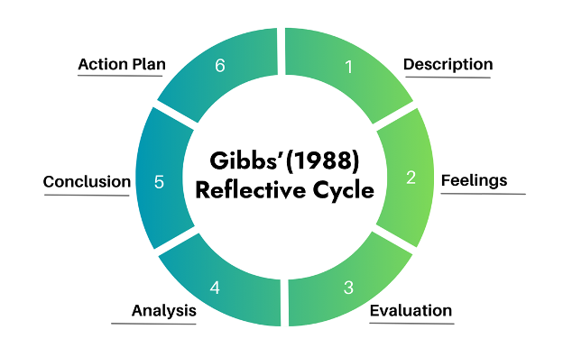

# Developing a Reflective Practice

## Overview {.unnumbered}

Welcome to LDRS 667 Practicum: Personal and Professional Practice and Reflection. In this course, you will engage in reflective practice as you complete your practicum in coaching and facilitation in a professional learning setting. Through reflective practice, you will pay attention to how you learn and grow through this real-life experience of coaching and facilitation. You will observe a seasoned teacher or facilitator, practice designing learning experiences for others, and apply what you have learned about how to facilitate deep learning in an authentic learning community. Throughout this experience, you are invited to stay curious, thoughtful, and reflective as you connect your values, emerging facilitation skills, and sense of purpose.

Take a moment now to review the learning outcomes for this course:

#### Course Learning Outcomes {.unnumbered}

Upon successful completion of this course, you should be able to:

1. Synthesize adult learning theory with practical experience facilitating or teaching
2. Design authentic and inclusive learning experiences
3. Demonstrate effective teaching/facilitation skills to support critical and creative thinking
4. Integrate cross-cultural competency into the teaching/learning process
5. Apply assessment strategies to measure student learning
6. Synthesize personal identity, values, and beliefs into the facilitation and teaching process
7. Engage in reflective practice within a facilitation/teaching role

In this practicum, you have the opportunity to put what you have learned in your graduate courses into practice within a professional context. Experiential learning is a powerful and rich learning opportunity.

> "Teaching and learning can become inherently spontaneous and student-centered when moved from the confines of the classroom into the world at large. From the collaborative learning atmosphere that results from the unique relationships developed outside the classroom, to the deep learning that occurs when students must put into practice "in the real world" what they have theorized about from behind a desk, field experiences are unmatched in their learning potential" [@ClaiborneTeachingoutside, p. 9].

In addition to applying your learning, you will also establish a practice of reflection, engaging in ongoing self-evaluation and analysis of your coaching/facilitation experience in order to continually refine your professional practice. It is our hope that you will not only enhance your coaching and facilitation skills through practice and reflection, but that you will also establish a practice of reflection that will enhance your professional effectiveness throughout your career.

In this practicum, you will design and implement lesson plans that include:

- student learning outcomes,
- learning activities, and
- assessment of student learning.

Through this process, you will apply what you have learned in prior classes related to:

- adult learning theory,
- authentic and culturally inclusive learning experiences,
- cultural competency, and
- synthesizing your personal identity and values into your teaching/facilitation practice.

In this unit, we will focus on the concept and strategies of reflective practice, preparing you to engage in reflection throughout your practicum experience, using the Gibbs’ Reflective Cycle (1988). In order to maximize your learning, you will engage in reflective practice throughout this practicum, as you design three different lessons and facilitate those (or other) lessons during your practicum. Reflective practice can also be applied to other elements of your practicum, such as discussion facilitation (online or face-to-face), the design of learning activities, implementation of learning activities, and assessment of student learning.

### Topics {.unnumbered}

This unit is divided into the following topics:

1. Developing a Reflective Practice
2. Gibbs’ Reflective Cycle [-@Gibbs1988]

### Learning Outcomes {.unnumbered}

When you have completed this unit, you will be able to:

- Synthesize personal identity, values, and beliefs with personal learning outcomes for practicum experience.
- Describe key elements of reflective practice.

### Learning Activities {.unnumbered}

::: {.learning-activity}

Here is a list of learning activities that will support you in completing this unit. You may find it useful for planning your work.

- Read and review the resources provided, focusing on the adult learning principles you hope to integrate into your facilitation.
- Review the resources that provide a deeper look at Gibbs’ Reflective Cycle, and begin considering how you will apply this framework within your practicum setting.

:::

### Assessment {.unnumbered}

See the Assessment section in Moodle for assignment details.

### Required Texts and Materials {.unnumbered}

All resources will be provided online in the unit. Refer to the References section at the end of the unit for the full list.

## Developing a Reflective Practice

In this practicum, you will have an opportunity to implement coaching and facilitation strategies that you have learned in prior courses. You will integrate adult learning theory principles as you design learning experiences, in order to enhance and deepen learning for your learners. You will practice culturally inclusive facilitation methods, seek to create an authentic learning community, and practice your coaching/facilitation skills to enhance transformational learning. A practicum provides an important framework for practicing and applying the skills and techniques you have developed. This practice, combined with critical reflection, will allow you to continue to grow and develop as a professional.

Reflective practice provides a framework for thinking of our work as educators, challenging us not just to *do* but to continually refine our practice. Through this process, we are challenged to continually evaluate and assess our own teaching and how it influences student learning. Reflective practice allows us to think of our facilitation experience not just as the facilitation itself, but also as a three-part process that includes: 1) reflection and preparation (prior to facilitation), 2) reflection while we are facilitating, and reflection after the facilitation experience. Lefebrve et al. [-@lefebvreReflectionTeachingAction2023] describe this as: "1) Reflection before action; 2) Refection in action; and 3) Reflection on action): (p. 2).

Larrivee [-@larriveeTransformingTeachingPractice2000] argues that "When teachers become reflective practitioners, they move beyond a knowledge of discrete skills to a stage where they integrate and modify skills to fit specific contexts, and eventually, to a point where the skills are internalized enabling them to invent new strategies" (p. 294). Similarly, Palmer [-@palmerCourageTeachExploring2017] contends that "good teaching cannot be reduced to technique; good teaching comes from the identity and integrity of the teacher" (p. 10).

Reflective practice, or "critical reflection" as Larrivee [-@larriveeTransformingTeachingPractice2000] refers to it, is "a personal awareness discovery process" (p. 296). She argues against a prescribed process, but instead advocates for ongoing commitment to "making time for solitary reflection, becoming a perpetual problem-solver and questioning the status quo" [Larrivee 1999, as cited in @larriveeTransformingTeachingPractice2000, p. 296]. She suggests that a reflective journal can be an important tool for self-engagement.

Building on this recommendation, in this class you will engage in ongoing written reflection on your learning. For each lesson that you design, you will engage in reflection through Reflective Practice Discussion posts. Writing can be a powerful learning experience, as we engage in reflection and critical analysis of the new concepts we discover. Through regular writing, we are challenged to think critically, organize, and integrate these new concepts with our prior understanding.

Read the following articles and websites on adult learning theory principles. As you read, consider the role of reflective practice in your practicum experience. Be thinking about how you would engage in reflective practice through each element of your practicum: classroom observation, lesson plan design, and facilitation/teaching elements of your practicum.

### Activity: Adult Learning Theory Principles

::: {.learning-activity}

Read and review the following resources. As you read, be sure to focus on the adult learning principles you hope to integrate into your facilitation. As you design lessons for this practicum, you will be required to integrate adult learning theory into your lesson plan design.

- Bouchrika, I. [-@AndragogyApproachKnowles2021]. [The andragogy approach: Knowles’ adult learning theory principles in 2026.](https://research.com/education/the-andragogy-approach){target="_blank"} Education.
- Merriam, S. [-@merriamAndragogySelfDirectedLearning2001]. [Andragogy and self-directed learning: Pillars of adult learning theory](https://research-ebsco-com.twu.idm.oclc.org/linkprocessor/plink?id=2c18984a-7924-30b0-bdbd-805ffc062e0d){target="_blank"}. *New Directions for Adult and Continuing Education*, *2001*(89), 3-13. [https://doi.org/10.1002/ace.3](https://doi-org.twu.idm.oclc.org/10.1002/ace.3){target="_blank"}

:::

## Gibb’s Reflective Cycle (1988)

Reflective practice generally begins with self-evaluation (prior to the facilitation experience) and then includes ongoing reflection, both before and after the facilitation experience. As you assess your facilitation, you will engage in reflective questioning, drawing conclusions, and identifying areas for further inquiry. Reflective practice is generally an individual practice -- but can also include elements of peer observation and feedback. As Larrivee [-@larriveeTransformingTeachingPractice2000] argues, one important aspect of critical reflection involves questioning the status quo. As we engage in reflective practice, we not only consider our own facilitation, but should also be "examining the assumptions that underlie classroom practices" [@larriveeTransformingTeachingPractice2000, p. 297]. Noticing and questioning the assumptions we have about how teaching or facilitation *should* happen is particularly important.

Since most of us have been students ourselves, we can too easily fall into the habit of replicating the way we have been taught, without evaluating the effectiveness of those practices. For example, as students, we may have observed that facilitators not only lead conversations, they also talk the most. However, many researchers who study learning argue that we need to shift from a teacher-centered approach to teaching to a learner-centered approach, in which students talk more than teachers [@malikExploringImpactExcessive2023]. By reflecting on our own assumptions, we can create space for learning and practicing new facilitation approaches that may result in deeper learning for our learners.

Larrivee [-@larriveeTransformingTeachingPractice2000] describes a process of critical reflection that involves three stages, arguing that the process is "more cyclical than linear, more incremental than sequential" (p. 304). The process she lays out includes the three key elements/stages of "examination," "struggle," and "perceptual shift" (p. 305).

As you prepare for your coaching/facilitation experiences in your practicum, you are challenged to consider the value of reflective practice. You will also develop your own practice of self-reflection and critical inquiry. We will explore Gibbs’ Reflective Cycle, which you will use throughout this practicum. We hope you will take this practice into your own coaching and facilitation experiences beyond this course.

Gibbs’ Reflective Cycle [-@Gibbs1988] includes six steps: description, feelings, evaluation, analysis, conclusion, and action plan. As you engage in your professional practice through this practicum, you will be asked to complete these steps for each element of the practicum (i.e. classroom observation, lesson plan design, and facilitation).

::: {#fig-image}

{#fig-u2_1 .lightbox fig-alt="A Cyclical Diagram Showing the Reflective Cycle"}

*A Cyclical Diagram Showing the Reflective Cycle*

:::

::: text-source
*Source:* Created by C. P. Navarro, R. Kang, and TWU. Licensed under [CC BY-SA 4.0](https://creativecommons.org/licenses/by-sa/4.0/){target="_blank"}

::: 

1. **Description:** You will begin by describing the teaching/facilitation experience (or the process of designing a lesson plan).
2. **Feelings:** You will consider how you felt during the facilitation process -- and how your students felt.
3. **Evaluation:** In this step, you will evaluate the experience. What worked well? What didn’t work at all?
4. **Analysis:** You will then analyze the experience. At this stage, you will find it helpful to look at the experience through the lens of the literature you have read in previous courses. Did you miss out on an opportunity for learning because you didn’t assume prior knowledge (a component of adult learning theory)? Did you create an authentic learning community by connecting students with each other? Did your students engage deeply because you incorporated different ways of knowing into the discussion?
5. **Conclusion:** At this stage, you will draw conclusions about your facilitation experience.
6. **Action Plan:** Based on what you learned through this reflection, you will develop steps to take to continually improve your teaching/facilitation practice.

You may have noticed that Gibbs’ Reflective Cycle does not specifically include the planning and "pre-flection" elements that Larrivee [-@larriveeTransformingTeachingPractice2000] argues for. Because reflection is such an important part of preparation, we encourage you to begin your reflective practice as you design your lesson – and prepare yourself for the facilitation experience.

### Activity: Reflective Practice

::: {.learning-activity}

In the Learning Activities, you will review resources that provide a deeper look at Gibbs’ Reflective Cycle. As you review those resources, begin thinking about how you will apply these within your practicum setting. You will write about this in your Reflective Practice Discussion 2.

Read the following resources:

- Larrivee, B. [-@larriveeTransformingTeachingPractice2000]. [Transforming teaching practice: Becoming the critically reflective teacher](http://ed253jcu.pbworks.com/w/page/f/Larrivee_B_2000CriticallyReflectiveTeacher.pdf){target="_blank"}. *Reflective Practice, 1*(3), 293–307.
- Machost, H., & Stains, M. [-@machostReflectivePracticesEducation2023]. Reflective practices in education: A primer for practitioners. *CBE Life Sciences Education*, 22. [https://doi.org/10.1187/cbe.22-07-0148.](https://doi.org/10.1187/cbe.22-07-0148.){target="_blank"}
- Forrest, M. E. S. [-@forrestBecomingCriticallyReflective2008]. [On becoming a critically reflective practitioner](https://research.ebsco.com/c/bljv25/viewer/pdf/eyoqvzgjin){target="_blank"}. *Health Information & Libraries Journal, 25*(3), 229-232.
- Galli, F. & New, K.J. [-@galliGibbsCycleReview2022]. [Gibbs’ cycle review: Emotions as a part of the cycle](https://research-ebsco-com.twu.idm.oclc.org/linkprocessor/plink?id=228f362e-3473-331b-912a-9a034ef88fc8){target="_blank"}. *e-Motion: Revista de Educación, Motricidad e Investigación*. [https://doi.org/10.33776/remo.vi19.7224](https://doi.org/10.33776/remo.vi19.7224){target="_blank"}.
- Lefebvre, J., Lefebvre, H., Gauvin-Lepage, J., Gosselin, R., & Lecocq, D. [-@lefebvreReflectionTeachingAction2023]. [Reflection on teaching action and student learning](https://research-ebsco-com.twu.idm.oclc.org/linkprocessor/plink?id=d0a665af-09c7-3a19-b317-29aa3d9b282a){target="_blank"}. *Teaching and Teacher Education, 134*(2023),1-10. [https://doi.org/10.1016/j.tate.2023.104305](https://doi.org/10.1016/j.tate.2023.104305){target="_blank"}.
- Masharipova, F. [-@masharipovaFosteringReflectivePractice2025]. Fostering reflective practice: A pathway to effective teaching and professional growth. *Pubmedia Jurnal Pendidikan Bahasa Inggris*. [https://doi.org/10.47134/jpbi.v2i3.1537](https://doi.org/10.47134/jpbi.v2i3.1537){target="_blank"}.

Select one of the following articles to learn more about a topic you’re interested in:

- If you want to learn more about learning outside a formal classroom, read: Claiborne, L., Morrell, J., Bandy, J., & Bruff, D. [-@ClaiborneTeachingoutside] [Teaching outside the Cclassroom](https://share.google/chd7PjtKHJpnmRB90){target="_blank"}. Vanderbilt University Center for Teaching and Learning.
- If you’d like to learn more about Gibbs’ Reflective Cycle, including examples, read one of the following:
    - Mulder, P. [-@MulderGibbsReflectiveCycle2018]. [Gibbs' Reflective Cycle](https://www.toolshero.com/management/gibbs-reflective-cycle-graham-gibbs/){target="_blank"} by Graham Gibbs.
    - University of Edinburgh [-@ReflectiveCycle]. [Gibbs' Reflective Cycle](https://www.ed.ac.uk/reflection/reflectors-toolkit/reflecting-on-experience/gibbs-reflective-cycle){target="_blank"}.

:::

## Summary {.unnumbered}

In this unit, you have had the opportunity to learn about reflective practice, and how it can help you develop as a facilitator. Engaging in reflective practice throughout your practicum as you participate in classroom observation, designing lesson plans, and facilitating learning can help you develop a process through which you become a critically reflective practitioner throughout your career.

::: {.check}

Before you move on to the next unit, you may want to check to make sure that you are able to:

- Synthesize personal identity, values, and beliefs with personal learning outcomes for practicum experience.
- Describe key elements of reflective practice.

:::

## References {.unnumbered}

<!-- Claiborne, L., Morrell, J., Bandy, J., & Bruff, D. (2018). Teaching outside the classroom. Vanderbilt University Center for Teaching. Retrieved from: [https://cft.vanderbilt.edu/guides-sub-pages/teaching-outside-the-classroom](https://cft.vanderbilt.edu/guides-sub-pages/teaching-outside-the-classroom){target="_blank"}

Forrest, Margaret E. S. (2008). On becoming a critically reflective practitioner. Health Information & Libraries Journal, 25(3), 229-232.

Larrivee, B. (2000). Transforming teaching practice: Becoming the critically reflective teacher. Reflective Practice, 1(3), 293–307. Retrieved from: [http://ed253jcu.pbworks.com/w/page/f/Larrivee_B_2000CriticallyReflectiveTeacher.pdf](http://ed253jcu.pbworks.com/w/page/f/Larrivee_B_2000CriticallyReflectiveTeacher.pdf){target="_blank"}

Malik, H.A., Jalall, M.A, RazaAbbasi, S.A, & Rashid, A. (2023). Exploring the impact of excessive teacher talk time on participation and learning of English language learners. *VFAST Transactions on Education and Social Sciences*, *11(2)*, 46-55.

Merriam, S. (2001). Andragogy and self-directed learning: Pillars of adult learning theory. *New Directions for Adult and continuing Education*, 89. Jossey-Bass.

Mulder, P. (2018). Gibbs’ Reflective Cycle by Graham Gibbs. Retrieved from: [https://www.toolshero.com/management/gibbs-reflective-cycle-graham-gibbs/](https://www.toolshero.com/management/gibbs-reflective-cycle-graham-gibbs/){target="_blank"}

University of Edinburgh (n.d.). Gibbs’ Reflective Cycle. Retrieved from: [https://www.ed.ac.uk/reflection/reflectors-toolkit/reflecting-on-experience/gibbs-reflective-cycle](https://www.ed.ac.uk/reflection/reflectors-toolkit/reflecting-on-experience/gibbs-reflective-cycle){target="_blank"} -->

<!-- ## Discussion 1: Reflective Practice – Experiential Leaning

### Instructions {.unnumbered}

Write a discussion post including the following:

- Describe the context in which you will conduct your experiential learning (practicum). (Consider whether you want or need to keep the site anonymous and, if so, be sure to avoid identifying details.)
- List the three personal learning outcomes you developed for your practicum experience (from your Practicum Proposal). For each learning outcome, specifically describe how you will assess your own learning. (In other words, how will you know if you’ve learned what you hope to learn?)
- Building on what you learned in previous courses, share some reflective thoughts about how you hope to integrate your identity, values, and beliefs as a teacher/facilitator into your practicum experience.

Respond to the posts of two other learners, providing reflective feedback on their learning outcomes, practicum experience, and/or their integration of their identity, values, and beliefs with their practicum plans.

### Rubric {.unnumbered}

<table> <colgroup> <col style="width: 20%" /> <col style="width: 20%" /> <col style="width: 20%" /> <col style="width: 20%" /> <col style="width: 20%" /> </colgroup> <thead> <tr class="header"> <th><strong>Criteria</strong></th> <th><strong>Needs Improvement (0%)</strong></th> <th><strong>Developing</strong> <strong>(70%)</strong></th> <th><strong>Proficient</strong> <strong>(80%)</strong></th> <th><strong>Exemplary (100%)</strong></th> </tr> </thead> <tbody> <tr class="odd"> <td><strong>APA/Writing</strong></td> <td>Writing is not well-organized. Several errors in grammar or composition. Sources are not cited. APA citations are not appropriately formatted.</td> <td>Writing is somewhat well organized and includes some errors in grammar or composition. Not all sources cited. APA citations are generally formatted correctly, with several errors.</td> <td>Writing is well-organized and includes few (if any) errors in grammar or composition. All resources are appropriately cited (including in-text citations and bibliography information). Few (if any) errors in APA citations.</td> <td>Writing is well-organized and free of errors in grammar or composition. All resources are appropriately cited. No errors in APA format.</td> </tr> <tr class="even"> <td><strong>Developing a Cohesive and Logical Academic argument</strong></td> <td>Does not make a focused, cohesive, or logical academic argument. Posts and responses are confusing, and is missing an introduction, body, or conclusion. Transitions between sections and ideas are missing.</td> <td>Makes an academic argument that is only partially focused, cohesive and logical. Posts and responses are generally organized, but are missing an introduction, body, or conclusion. Transitions between sections and ideas are unclear.</td> <td>Makes a focused, cohesive, logical academic argument. Posts and responses are effectively organized and include an introduction, body, and conclusion. Transitions between sections and ideas are clear.</td> <td>Makes a focused, cohesive, logical and compelling academic argument. Posts and responses are effectively organized and include an introduction, body, and conclusion. Transitions between sections and ideas are clear, and build on each other.</td> </tr> <tr class="odd"> <td><strong>Interview Synopsis and Analysis</strong></td> <td>Does not include a detailed discussion of key elements of a culturally-inclusive learning community, including the physical environment, teacher/student relationships, and key aspects of the community. Does not include an analysis.</td> <td>Lists but does not discuss key elements of a culturally-inclusive learning community, including the physical environment, teacher/student relationships, and key aspects of the community. Includes a partial analysis.</td> <td>Includes a detailed discussion of key elements of a culturally-inclusive learning community, including the physical environment, teacher/student relationships, and key aspects of the community. Includes a thoughtful analysis.</td> <td>Includes a detailed discussion of key elements of a culturally-inclusive learning community, including the physical environment, teacher/student relationships, and key aspects of the community. Includes a thoughtful analysis, integrating scholarly literature to support analysis and furthering scholarly thinking related to inclusive learning environments.</td> </tr> <tr class="even"> <td><strong>Scholarly Integration</strong></td> <td>Does not integrate references to support claims and assertions made in the paper.</td> <td>Integrates references to support some of the claims and assertions made in the paper.</td> <td>Integrates references to support claims and assertions made in the paper.</td> <td>Integrates references to support claims and assertions made in the paper, effectively synthesizing different perspectives and research results from scholarly sources.</td> </tr> <tr class="odd"> <td></td> <td><strong>Needs Improvement (0%)</strong></td> <td><strong>Developing</strong> <strong>(70%)</strong></td> <td><strong>Proficient</strong> <strong>(80%)</strong></td> <td><strong>Exemplary (100%)</strong></td> </tr> </tbody> </table>

## Discussion 2: Reflective Practice – Applying a Reflective Practice Model

### Instructions {.unnumbered}

Outline a plan for how you will apply the six key elements of Gibbs’ (1988) Reflective Cycle, in your classroom observations and teaching/facilitation experience.

Respond to the posts of two other learners, providing suggestions for how they might maximize their experience of the reflective cycle in their practicum.

### Rubric {.unnumbered}

<table> <colgroup> <col style="width: 20%" /> <col style="width: 20%" /> <col style="width: 20%" /> <col style="width: 20%" /> <col style="width: 20%" /> </colgroup> <thead> <tr class="header"> <th><strong>Criteria</strong></th> <th><strong>Needs Improvement (0%)</strong></th> <th><strong>Developing</strong> <strong>(70%)</strong></th> <th><strong>Proficient</strong> <strong>(80%)</strong></th> <th><strong>Exemplary (100%)</strong></th> </tr> </thead> <tbody> <tr class="odd"> <td><strong>APA/Writing</strong></td> <td>Disc Writing is not well-organized. Several errors in grammar or composition. Sources are not cited. APA citations are not appropriately formatted.</td> <td>D Writing is somewhat well organized and includes some errors in grammar or composition. Not all sources cited. APA citations are generally formatted correctly, with several errors.</td> <td>Discussion Writing is well-organized and includes few (if any) errors in grammar or composition. All resources are appropriately cited (including in-text citations and bibliography information). Few (if any) errors in APA citations.</td> <td>Writing is well-organized and free of errors in grammar or composition. All resources are appropriately cited. No errors in APA format.</td> </tr> <tr class="even"> <td><strong>Developing a Cohesive and Logical Academic argument</strong></td> <td>Does not make a focused, cohesive, or logical academic argument. Posts and responses are confusing, and is missing an introduction, body, or conclusion. Transitions between sections and ideas are missing.</td> <td>Makes an academic argument that is only partially focused, cohesive and logical. Posts and responses are generally organized, but are missing an introduction, body, or conclusion. Transitions between sections and ideas are unclear.</td> <td>Makes a focused, cohesive, logical academic argument. Posts and responses are effectively organized and include an introduction, body, and conclusion. Transitions between sections and ideas are clear.</td> <td>Makes a focused, cohesive, logical and compelling academic argument. Posts and responses are effectively organized and include an introduction, body, and conclusion. Transitions between sections and ideas are clear, and build on each other.</td> </tr> <tr class="odd"> <td><strong>Interview Synopsis and Analysis</strong></td> <td>Does not include a detailed discussion of key elements of a culturally-inclusive learning community, including the physical environment, teacher/student relationships, and key aspects of the community. Does not include an analysis.</td> <td>Lists but does not discuss key elements of a culturally-inclusive learning community, including the physical environment, teacher/student relationships, and key aspects of the community. Includes a partial analysis.</td> <td>Includes a detailed discussion of key elements of a culturally-inclusive learning community, including the physical environment, teacher/student relationships, and key aspects of the community. Includes a thoughtful analysis.</td> <td>Includes a detailed discussion of key elements of a culturally-inclusive learning community, including the physical environment, teacher/student relationships, and key aspects of the community. Includes a thoughtful analysis, integrating scholarly literature to support analysis and furthering scholarly thinking related to inclusive learning environments.</td> </tr> <tr class="even"> <td><strong>Scholarly Integration</strong></td> <td>Does not integrate references to support claims and assertions made in the paper.</td> <td>Integrates references to support some of the claims and assertions made in the paper.</td> <td>Integrates references to support claims and assertions made in the paper.</td> <td>Integrates references to support claims and assertions made in the paper, effectively synthesizing different perspectives and research results from scholarly sources.</td> </tr> <tr class="odd"> <td></td> <td><strong>Needs Improvement (0%)</strong></td> <td><strong>Developing</strong> <strong>(70%)</strong></td> <td><strong>Proficient</strong> <strong>(80%)</strong></td> <td><strong>Exemplary (100%)</strong></td> </tr> </tbody> </table> -->
